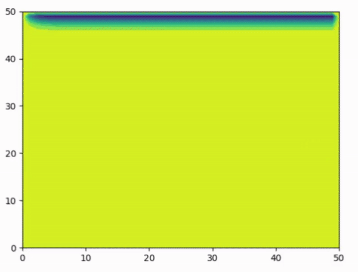

# LidDrivenCavityProblem

This repository contains the parts of my semester project in ME5101 Computational Fluid Dynamics course. Here I have simulated the flow taking place in the lid-driven cavity problem.

There are two main python files
* `unsteadySteady.py` Contains the simulation for the transient regime
* `steadySteady.py` Contains the simulation for the steady state regime

To see the in-depth details and the physics of the problem please refer to the [project report](https://github.com/AakashSYadav/LidDrivenCavityProblem/blob/master/projectReport.pdf)

| Code | Report |
|------|--------|
|<https://github.com/nimRobotics/LidDrivenCavityProblem> | <https://github.com/AakashSYadav/LidDrivenCavityProblem/blob/master/projectReport.pdf> |

The below image show the simulation for the unsteady state analysis.

